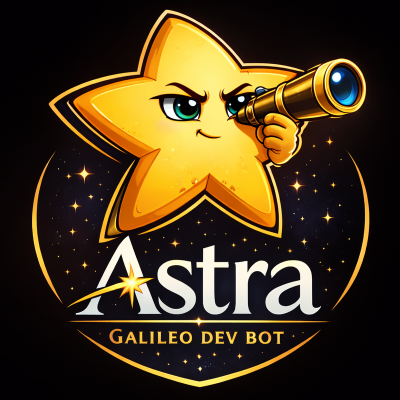
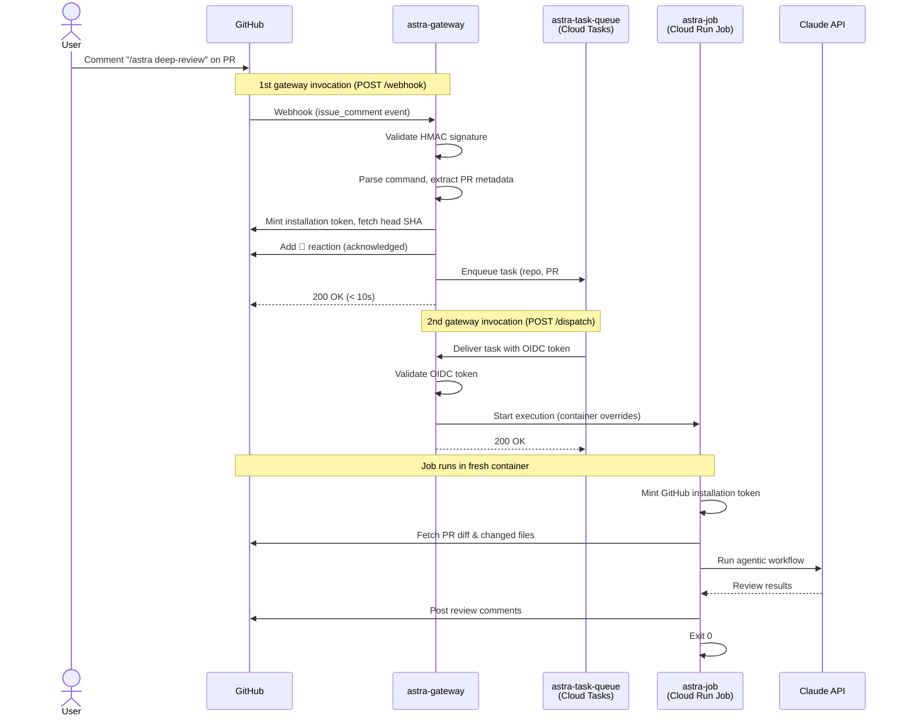

# Astra

Galileo dev bot.  Runs agent-enabled commands in a remote container.



## Commands

- `review`: PR review

## Implementation

A CLI wrapping Claude Agent SDK workflows with Galileo-specific skills, tools and development environment setup.

The CLI is activated through an asynchronous command pipeline and runs in sandbox containers via GCP Cloud Tasks.

## Architecture



## Directory Structure

```
astra/
├── assets/                  # Logo and static assets
├── deployment/              # Deployment and provisioning scripts
├── gateway/                 # Webhook receiver + task dispatcher (Cloud Run service)
│   ├── Dockerfile
│   ├── pyproject.toml
│   ├── src/astra_gateway/
│   └── tests/
└── job/                     # Agentic workflow runner (Cloud Run job)
    ├── Dockerfile
    ├── pyproject.toml
    ├── src/astra/
    └── tests/
```

## Deployment

### Provisioning scripts

Run from `bots/astra/`:

| Script | Purpose |
|---|---|
| `deployment/provision_secrets.py` | Provisions GitHub App credentials in GCP Secret Manager |
| `deployment/provision_infra.py` | Creates service accounts, IAM bindings, and Cloud Tasks queue |

Run `provision_secrets.py` first, then `provision_infra.py`. Both are idempotent and safe to re-run.

### GCP resources

| Type | Name | Description |
|---|---|---|
| **Secret** | `astra-webhook-secret` | HMAC secret for validating GitHub webhook payloads |
| **Secret** | `astra-app-id` | GitHub App ID |
| **Secret** | `astra-app-private-key` | GitHub App private key (PEM) |
| **Service account** | `astra-gateway` | Used by the gateway Cloud Run service |
| **Service account** | `astra-job` | Used by the job Cloud Run job |
| **Cloud Tasks queue** | `astra-task-queue` | Dispatches review jobs (region: `us-west1`) |
| **Cloud Run service** | `astra-gateway` | Receives GitHub webhooks and enqueues tasks |
| **Cloud Run job** | `astra-job` | Executes PR reviews in a sandboxed container |

## Why the name Astra?

Astra comes from the Latin word for “stars,” a nod to Galileo Galilei and his work observing the heavens.

The name reflects Galileo’s legacy of careful observation, discovery, and turning what we see into evidence.
